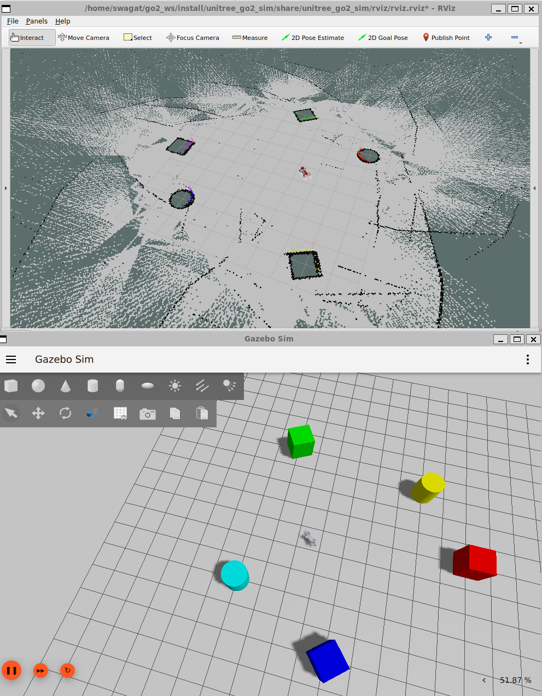
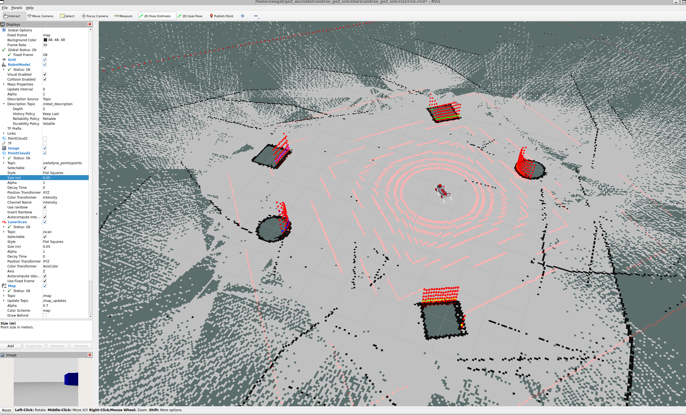

# Running SLAM with Unitree Go2 Quadruped Robot

## Credits
forked from `RobInLabUJI/unitree_go2_ros2_jazzy`

## Dependencies
- Ubuntu 24.04 LTS (Tested on WSL2 version on Windows 11)
- ROS2 Jazzy
- Gazebo Harmonic


## Step 1: Download & Install

### 1.1 Install system dependencies
Update repositories and install all simulation, control, and mapping packages
```
# Check ROS 2 distribution
echo $ROS_DISTRO  # Must print 'jazzy'

# Update package lists and install required tools and simulation dependencies
sudo apt update && sudo apt install -y \
  git \
  python3-colcon-common-extensions \
  python3-rosdep \
  python3-pip \
  python3-yaml \
  binutils \
  ros-jazzy-ros-gz \
  ros-jazzy-ros-gz-bridge \
  ros-jazzy-ros-gz-sim \
  ros-jazzy-gz-ros2-control \
  ros-jazzy-ros2-control \
  ros-jazzy-ros2controlcli \
  ros-jazzy-ros2-controllers \
  ros-jazzy-joint-state-broadcaster \
  ros-jazzy-joint-trajectory-controller \
  ros-jazzy-effort-controllers \
  ros-jazzy-position-controllers \
  ros-jazzy-velocity-controllers \
  ros-jazzy-robot-localization \
  ros-jazzy-xacro \
  ros-jazzy-velodyne \
  ros-jazzy-velodyne-description \
  ros-jazzy-slam-toolbox \
  ros-jazzy-teleop-twist-keyboard \
  ros-jazzy-navigation2 \
  ros-jazzy-nav2-bringup \
  ros-jazzy-nav2-map-server \
  ros-jazzy-sensor-msgs-py \
  ros-jazzy-tf2-tools \
  ros-jazzy-rqt-graph

```
Configure WSL2 GUI rendering parameters:
```
echo "export QT_QPA_PLATFORM=xcb" >> ~/.bashrc
source ~/.bashrc

```

Initialize `rosdep` if not already completed:

```
sudo rosdep init 2>/dev/null || true
rosdep update

```

### 1.2 Workspace Creation and Repository Cloning

We will clone the **RobInLabUJI Unitree Go2 Gazebo Harmonic Simulation package** (which includes Gazebo models and CHAMP kinematics):

```
mkdir -p ~/go2_ws/src
cd ~/go2_ws/src

git clone https://github.com/swagatk/unitree_go2_ros2_jazzy.git
```

Verify that the expected packages are present:

```
ls ~/go2_ws/src/unitree_go2_ros2_jazzy
# Expected output: champ  champ_base  champ_msgs  README.md  slam_scripts  unitree_go2_description  unitree_go2_sim

```

### 1.3 Compiling the Workspace (WSL2 Memory Optimization)

To prevent the GNU linker (`ld`) from running out of RAM and crashing with `Signal 11 [Segmentation fault]` during the `champ_base` compilation, build `champ_base` with a single worker before compiling the rest:

```
cd ~/go2_ws

# 1. Resolve all dependencies
rosdep install --from-paths src --ignore-src -r -y

# 2. Compile champ_base first with 1 parallel worker to conserve memory
colcon build --symlink-install --packages-select champ_base --parallel-workers 1 --cmake-args -DCMAKE_BUILD_TYPE=Release

# 3. Build the remainder of the workspace
colcon build --symlink-install

# 4. Source the built environment
source install/setup.bash
echo "source ~/go2_ws/install/setup.bash" >> ~/.bashrc

```

## Step 2: Teleoperation and Sensor Visualization
Open separate terminal tabs for each process:

**Terminal 1: Gazebo Simulation Launch**

```
source ~/go2_ws/install/setup.bash
ros2 launch unitree_go2_sim unitree_go2_launch.py

```

**Terminal 2: PointCloud to LaserScan Converter**

```
source ~/go2_ws/install/setup.bash
ros2 run slam_scripts cloud_to_scan --ros-args -p use_sim_time:=true

```

**Terminal 3: Odometry Transform Broadcaster**

```
source ~/go2_ws/install/setup.bash
ros2 run slam_scripts odom_to_tf --ros-args -p use_sim_time:=true

```

**Terminal 4: Keyboard Teleoperation**

```
ros2 run teleop_twist_keyboard teleop_twist_keyboard

```

**Terminal 5: RViz2 Visualization**
*(If not already launched by the launch script)*

```
source /opt/ros/jazzy/setup.bash
ros2 run rviz2 rviz2

```

## Step 3: 2D Mapping with SLAM toolbox

Open a new terminal and launch the asynchronous mapping node, pointing `params_file` at the config installed by `slam_scripts`:

```
source ~/go2_ws/install/setup.bash
ros2 launch slam_toolbox online_async_launch.py \
  use_sim_time:=true \
  params_file:=$(ros2 pkg prefix slam_scripts)/share/slam_scripts/config/go2_slam.yaml

```

**Optional one-shot bringup:** Terminals 2, 3, and this SLAM Toolbox launch can be combined into a single command using the bundled launch file:

```
source ~/go2_ws/install/setup.bash
ros2 launch slam_scripts slam_bringup.launch.py use_sim_time:=true

```

### 3.3 Active Mapping in RViz2

Switch to your RViz2 window:

1. **Change Fixed Frame to `map`:** Under **Global Options**, click `Fixed Frame` and select **`map`** (Critical: if left as `odom`, the map will fail to render progressive updates).

2. Click **Add** $\rightarrow$ select **Map** $\rightarrow$ set `Topic` to **`/map`**.

3. Set **Durability Policy** to `Transient Local`.

4. Click **Reset** in the bottom-left corner of RViz.

Drive the robot around the colored obstacles using the teleop terminal. The white corridors of free space and sharp black boundary walls will expand outward as the robot explores.

### 3.4 Saving the Completed Map

Once the environment has been fully circumnavigated, export the occupancy grid to disk:

```
source /opt/ros/jazzy/setup.bash
ros2 run nav2_map_server map_saver_cli -f ~/go2_sim_map --ros-args -p use_sim_time:=true

```

Verify that the map files were written:

```
ls -lh ~/go2_sim_map.*
# Output:
# ~/go2_sim_map.pgm (Occupancy grid image)
# ~/go2_sim_map.yaml (Origin, resolution, and threshold metadata)

```

## Step 4: Autonomous Navigation with Nav2

The package includes a prebuilt map at `slam_scripts/map/go2_sim_map.yaml` and Nav2 parameters at `slam_scripts/config/go2_nav2_params.yaml`. After building and sourcing the workspace, start these processes in separate terminals.

**Terminal 1: Gazebo Simulation**

```
source ~/go2_ws/install/setup.bash
ros2 launch unitree_go2_sim unitree_go2_launch.py
```

**Terminal 2: PointCloud to LaserScan Converter**

```
source ~/go2_ws/install/setup.bash
ros2 run slam_scripts cloud_to_scan --ros-args -p use_sim_time:=true
```

**Terminal 3: Odometry Transform Broadcaster**

```
source ~/go2_ws/install/setup.bash
ros2 run slam_scripts odom_to_tf --ros-args -p use_sim_time:=true
```

**Terminal 4: Nav2 Localization and Navigation**

```
source ~/go2_ws/install/setup.bash
ros2 launch nav2_bringup bringup_launch.py \
  use_sim_time:=true \
  map:=$(ros2 pkg prefix slam_scripts)/share/slam_scripts/map/go2_sim_map.yaml \
  params_file:=$(ros2 pkg prefix slam_scripts)/share/slam_scripts/config/go2_nav2_params.yaml
```

Do not launch `slam_toolbox` while running this Nav2 command: Nav2 uses AMCL to localize against the saved map.

**Terminal 5: Executed Path Publisher (optional)**

```
source ~/go2_ws/install/setup.bash
ros2 run slam_scripts odom_to_path --ros-args -p use_sim_time:=true
```

This node publishes the localized trajectory on `/executed_path`. Add a `Path` display in RViz2, set its topic to `/executed_path`, and use the `map` fixed frame.

### Set the Initial Pose and a Goal

1. In RViz2, set **Fixed Frame** to `map` and add the `/map`, global costmap, local costmap, and `/executed_path` displays as needed.
2. Use **2D Pose Estimate** to set the robot's initial pose on the loaded map. The position and heading must correspond to the Gazebo spawn pose.
3. Wait until Nav2 is active, then use **Nav2 Goal** (or **2D Goal Pose**) to select a destination. Nav2 publishes velocity commands on `/cmd_vel`, which is bridged to the Go2 simulation.
4. Confirm the navigation stack is active with:

```
ros2 lifecycle get /bt_navigator
```

The command should report `active` before sending a goal.

## Images
* 2D map generated using slam toolbox


* Rviz config parameters / Sensor visualization


## Troubleshooting

* rosdep error:

When running rosdep command you may get the following error message:
```
$ rosdep install --from-paths src --ignore-src -r -y
ERROR: the following packages/stacks could not have their rosdep keys resolved
to system dependencies:
slam_scripts: Cannot locate rosdep definition for [ament_python]
Continuing to install resolvable dependencies...
#All required rosdeps installed successfully
swagat@aliensk:~/go2_ws$
```

This error could be ignored.  You may proceed to the next stage of building your ros2 package.